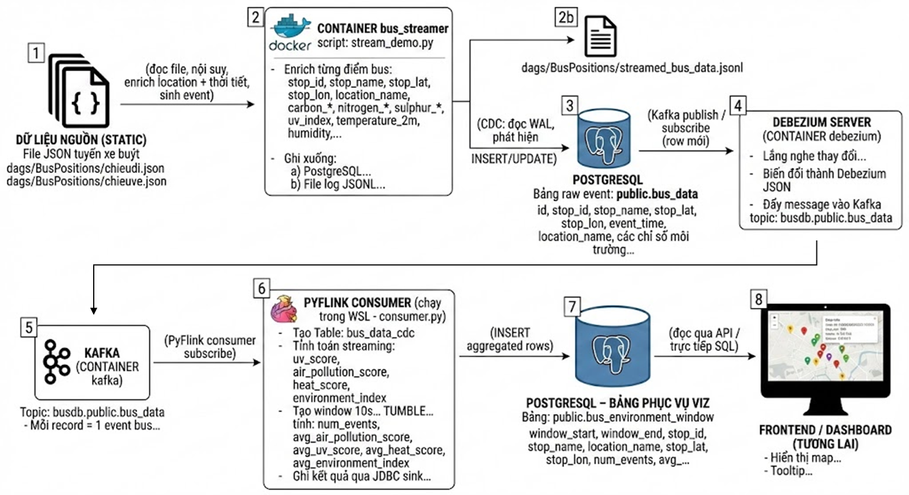

# Bus Environment Streaming Demo

Dự án demo pipeline streaming cho dữ liệu xe buýt Hà Nội, kết hợp:

- Vị trí xe buýt (bus stops / bus events),
- Dữ liệu thời tiết & chất lượng không khí từ Open-Meteo,
- Tính toán các chỉ số môi trường theo cửa sổ thời gian (10s) bằng PyFlink,
- Lưu kết quả vào PostgreSQL để phục vụ trực quan hóa (map, dashboard…).

---

## 1. Kiến trúc tổng quan

Luồng dữ liệu:



1. **bus_streamer (Python trong Docker)**

   - Đọc tuyến xe buýt từ `dags/BusPositions/chieudi.json`.
   - Nội suy & enrich từng điểm với:
     - Thông tin vị trí (`location_name`, `lat`, `lon`),
     - Thời tiết / không khí (`carbon_monoxide`, `uv_index`, `temperature_2m`, …).
   - Ghi vào bảng `public.bus_data` trong PostgreSQL.

2. **Debezium + PostgreSQL → Kafka**

   - Debezium lắng nghe thay đổi (CDC) trên bảng `bus_data`.
   - Mỗi insert vào `bus_data` được đẩy sang Kafka topic:
     - **`busdb.public.bus_data`** (định dạng **debezium-json**).

3. **PyFlink consumer (chạy ngoài Docker)**

   - Đọc Kafka topic `busdb.public.bus_data`.
   - Parse Debezium JSON → bảng logic `bus_data_cdc`.
   - Tính toán:
     - `uv_score`, `air_pollution_score`, `heat_score`,
     - `environment_index = 0.5 * air_pollution_score + 0.2 * uv_score + 0.3 * heat_score`.
   - Tạo tumbling window **10s** theo thời gian sự kiện (`event_time`) & `stop_id`.
   - Lưu kết quả vào bảng `public.bus_environment_window` trong PostgreSQL.

4. **Frontend / BI (chưa làm ở repo này)**
   - Đọc từ `bus_environment_window`, vẽ map + tooltip theo lat/lon, thời gian, index môi trường.

---

## 2. Cấu trúc thư mục (rút gọn)

```text
btl_bigdata/
├── Dockerfile               # Image cho bus_streamer
├── docker-compose.yml       # Định nghĩa dịch vụ: busdb, kafka, debezium, bus_streamer
├── dags/
│   ├── BusPositions/
│   │   ├── chieudi.json     # Dữ liệu tuyến chiều đi
│   │   ├── chieuve.json     # (chưa dùng)
│   │   └── streamed_bus_data.jsonl  # Log sự kiện bus đã enrich
│   ├── README.md            # (tùy chọn)
│   └── stream_demo.py       # Code stream & enrich bus → PostgreSQL
├── consumer.py              # PyFlink job: Kafka CDC → window → bus_environment_window
├── flink_libs/              # Thư viện JAR cho Flink
│   ├── flink-sql-connector-kafka-3.3.0-1.20.jar
│   ├── flink-sql-json-1.20.0.jar
│   ├── flink-connector-jdbc-3.3.0-1.20.jar
│   └── postgresql-42.7.3.jar
├── data/                    # Volume cho Docker (Postgres, Kafka, Debezium)
│   ├── postgres/
│   ├── kafka/
│   └── debezium/
└── requirements.txt         # (cho image Python)
```

## 3. Yêu cầu môi trường

**Trong host (WSL Ubuntu 22.04):**

- Docker + docker compose plugin.
- Conda env (ví dụ: `bus-env`) với:
  - Python 3.11
  - `pyflink`
  - Các dependency khác đã cài trong quá trình dev (`apache-beam`, …) – hiện tại đã hoạt động ổn.
- Java 17 (OpenJDK):

```bash
java -version
# → hiển thị version 17.x (đã OK)
```

- `/etc/hosts` có dòng:

```bash
sudo nano /etc/hosts
127.0.0.1 kafka
```

PostgreSQL chạy trong container busdb, timezone hợp lệ, ví dụ:

```bash
# trong container postgres.conf hoặc thông qua ALTER SYSTEM:
TimeZone = 'Asia/Bangkok'
# (tránh dùng 'Asia/Saigon' vì driver sẽ báo lỗi)
```

## 4. Cách khởi động toàn pipeline từ đầu

**Bước 1** – Mở WSL và vào thư mục dự án

```bash
cd ~/btl_bigdata
```

**\*Bước 2** – Bật hạ tầng Docker (Postgres + Kafka + Debezium)

```bash
docker compose up -d busdb kafka debezium
```

Kiểm tra:

```bash
docker ps
```

Kỳ vọng thấy các container:

- busdb (PostgreSQL, port 5432),
- kafka (Kafka broker, port 9092),
- debezium (Debezium server).

Nếu một container bị Restarting / Exited → xem log:

```bash
docker logs busdb
docker logs kafka
docker logs debezium
```

**Bước 3** – Chạy bus_streamer để bắn dữ liệu vào PostgreSQL
Trong cùng thư mục:

```bash
docker compose up bus_streamer
```

Container sẽ:

- Đọc tuyến bus từ dags/BusPositions/chieudi.json,
- Enrich từng điểm với thời tiết & location,
- INSERT khoảng 29 bản ghi vào public.bus_data,
- Sau đó exited với code 0 (hoàn thành một lượt stream).

Log sẽ có dạng:

```text
Đã ghi 29 bản ghi vào PostgreSQL và file: /app/dags/BusPositions/streamed_bus_data.jsonl
bus_streamer exited with code 0
```

Muốn bắn lại dữ liệu, chỉ việc chạy lại:

```bash
docker compose up bus_streamer
```

**Bước 4** – Chạy PyFlink consumer (Kafka → window → PostgreSQL)

Mở terminal mới:

```bash
cd ~/btl_bigdata

# bật conda env
conda activate bus-env

# chạy PyFlink job
python consumer.py
```

Script sẽ:

- Tạo StreamExecutionEnvironment & StreamTableEnvironment.
- Load các JAR Kafka, JSON, JDBC, Postgres từ thư mục flink_libs/.
- Đăng ký bảng Kafka bus_data_cdc (connector = 'kafka', format = 'debezium-json').
- Tính các chỉ số: `uv_score`, `air_pollution_score`, `heat_score`, `environment_index`.
- Tạo tumbling window 10s theo `event_time` & `stop_id`.
- Đăng ký sink JDBC bus_env_window_sink trỏ vào bảng public.bus_environment_window.
- Chạy statement:

```sql
INSERT INTO bus_env_window_sink
SELECT ...
FROM TUMBLE(...)
...;
```

`consumer.py` là chương trình streaming, nên terminal sẽ:

- In log giống như: Flink job đã được submit, đang chạy streaming...
- Treo tại đó (job vẫn chạy) cho tới khi bạn Ctrl + C.

## 5. Kiểm tra kết quả trong PostgreSQL

Mở terminal khác để vào Postgres:

```bash
cd ~/btl_bigdata
docker exec -it busdb psql -U admin -d busdb
```

Trong psql:

```sql
-- Bảng raw event từ bus_streamer
SELECT *
FROM bus_data
ORDER BY event_time DESC
LIMIT 5;

-- Bảng window 10s cho visualization
SELECT *
FROM bus_environment_window
ORDER BY window_end DESC
LIMIT 5;
```

Một dòng mẫu trong `bus_environment_window`:

| window_start           | window_end             | stop_id | stop_name     | location_name | stop_lat | stop_lon  | num_events | avg_air_pollution_score | avg_uv_score | avg_heat_score | avg_environment_index |
| ---------------------- | ---------------------- | ------- | ------------- | ------------- | -------- | --------- | ---------- | ----------------------- | ------------ | -------------- | --------------------- |
| 2025-12-09 16:37:10+00 | 2025-12-09 16:37:20+00 | ...     | Stop 26 1 S29 | Ngõ 583 ...   | 20.99... | 105.86... | 1          | 0.6005...               | 0.2          | 0.3            | 0.43025...            |

Các cột quan trọng:

- `window_start`, `window_end` : khoảng thời gian 10s (theo event_time).
- `stop_id`, `stop_name`, `location_name`, `stop_lat`, `stop_lon` : định danh vị trí trên map.
- `num_events` : số event trong window đó.
- `avg_air_pollution_score` : trung bình score ô nhiễm (0–1).
- `avg_uv_score` : trung bình score UV (0–1).
- `avg_heat_score` : trung bình score nóng bức (0–1).
- `avg_environment_index` : chỉ số tổng hợp, dùng để tô màu điểm trên map.

## 6. Quy trình thường dùng lúc phát triển

Giả sử bạn đã khởi động stack và muốn chạy lại:

### 6.1. Bắn lại dữ liệu raw

```bash
docker compose up bus_streamer
```

### 6.2. Nếu PyFlink consumer đang chạy

Nó sẽ tự đọc các event mới từ Kafka và cập nhật thêm vào bus_environment_window.

Không cần restart consumer.py trừ khi bạn đổi code.

### 6.3. Nếu bạn sửa consumer.py (logic compute, window…)

Trong terminal PyFlink: Ctrl + C để dừng job hiện tại.

Chạy lại:

```bash
python consumer.py
```

## 7. Tắt toàn bộ hệ thống

Khi không dùng nữa:
Dừng consumer.py:

- Trong terminal chạy PyFlink: Ctrl + C.

Tắt các container Docker:

```bash
cd ~/btl_bigdata
docker compose down
```

Dữ liệu:
PostgreSQL / Kafka vẫn giữ trong:

- data/postgres,
- data/kafka,
- data/debezium.

Nếu muốn reset hoàn toàn (xóa data), có thể xóa thư mục data/ (cân nhắc kỹ):

```bash
rm -rf data/
```

## 8. Hướng mở rộng

Một số hướng tiếp theo (chưa implement trong repo):

- Thêm bảng / endpoint API đọc bus_environment_window cho frontend.
- Thêm các chỉ số môi trường khác (PM2.5, PM10, …) nếu nguồn dữ liệu cho phép.
- Đổi window size (30s, 1 phút) hoặc dùng window trượt (sliding window).
- Lưu cả chi tiết từng event (raw) cho mục đích debug / phân tích lịch sử.
- Viết Dockerfile riêng cho PyFlink job để chạy trong container (thay vì chạy trực tiếp trong WSL).
