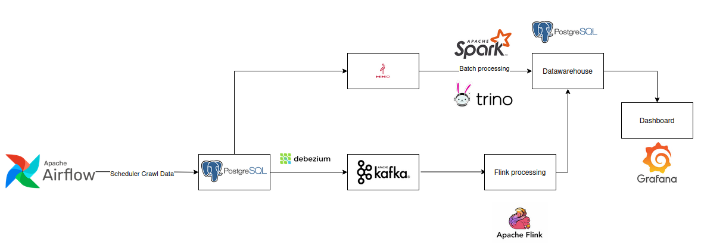

# Real-time Bus Tracking & Environmental Monitoring Pipeline

A comprehensive Big Data project (IT4931) that implements a scalable, cloud-native data pipeline for real-time bus position tracking and environmental monitoring using modern data engineering technologies on Kubernetes.

## Project Overview

This project processes real-time bus position data streams and environmental sensor data to provide comprehensive insights into urban transportation and air quality. The system leverages a modern data lakehouse architecture with real-time stream processing, batch analytics, and automated reporting capabilities.

**Key Features:**
- Real-time bus position tracking and analysis
- Environmental data integration (AQI, weather metrics)
- Automated ETL pipelines with data quality checks
- Scalable processing on Kubernetes infrastructure
- Interactive dashboards and automated reporting
- Data lake storage with efficient querying capabilities

## System Architecture



The system follows a modern data lakehouse architecture with the following data flow:

1. **Data Ingestion Layer**
   - Debezium for Change Data Capture (CDC)
   - Simulated bus position data streams
   - Environmental sensor data ingestion

2. **Message Streaming**
   - Apache Kafka for reliable event streaming
   - Schema Registry for data governance
   - Zookeeper for cluster coordination

3. **Stream Processing**
   - Apache Flink for real-time bus position processing
   - Low-latency data enrichment and transformations

4. **Data Storage**
   - MinIO as S3-compatible data lake storage
   - PostgreSQL as operational data warehouse
   - Delta Lake format for ACID transactions

5. **Batch Processing**
   - Apache Spark for large-scale data processing
   - Multi-stage ETL pipelines (s1-s6)
   - Data aggregation and analytics

6. **Orchestration**
   - Apache Airflow for workflow management
   - Automated DAG scheduling and monitoring

## Tech Stack

**Infrastructure:**
- Kubernetes (Minikube for local development)
- Docker for containerization
- Helm for package management

**Data Processing:**
- Apache Kafka + Zookeeper (Event Streaming)
- Apache Flink (Stream Processing)
- Apache Spark (Batch Processing)
- Apache Airflow (Workflow Orchestration)

**Storage:**
- MinIO (Data Lake - S3 Compatible)
- PostgreSQL (Data Warehouse)
- Delta Lake (Table Format)

**Data Integration:**
- Debezium (Change Data Capture)
- Kafka Connect (Data Integration)

**Programming Languages:**
- Python (PySpark, Flink Python API)
- SQL (Data Transformations)

## Prerequisites

Ensure the following tools are installed on your system:

**Required:**
- Docker (v20.0+)
- Minikube (v1.25+)
- kubectl (v1.23+)
- Helm (v3.8+)
- Python (v3.11)

**Optional:**
- DBeaver or similar SQL client for data exploration
- Postman for API testing

**System Requirements:**
- Minimum 8GB RAM
- 20GB available disk space
- CPU with virtualization support

## Project Structure

```
BTL_IT4931/
├── k8s/                          # Kubernetes manifests and configurations
│   ├── datalake.yaml            # MinIO data lake setup
│   ├── datawarehouse.yaml       # PostgreSQL configuration
│   ├── debezium-connect.yaml    # CDC connector setup
│   ├── minio.yaml               # Object storage configuration
│   ├── flink/                   # Stream processing configurations
│   ├── helm/                    # Helm charts and deployment scripts
│   └── kafka/                   # Event streaming infrastructure
├── services/                     # Application services and code
│   ├── airflow/                 # Workflow orchestration
│   │   ├── src/dags/           # Airflow DAGs
│   │   └── src/dags/spark/     # Spark job definitions
│   ├── batch/                   # Batch processing jobs
│   │   └── src/jobs/           # Spark batch processing jobs
│   └── stream/                  # Stream processing applications
│       └── bus_positions_job.py # Flink streaming job
└── imgs/                        # Documentation assets
    └── architecture.png         # System architecture diagram
```

## Deployment Guide

### Step 1: Environment Setup

1. **Start Minikube cluster:**
```bash
minikube start --memory=8192 --cpus=4
```

2. **Enable required addons:**
```bash
minikube addons enable ingress
minikube addons enable dashboard
```

### Step 2: Build Container Images

Build all required Docker images:
```bash
chmod +x services/build_images.sh
./services/build_images.sh
```

### Step 3: Deploy Infrastructure Components

1. **Deploy Kafka ecosystem:**
```bash
kubectl apply -f k8s/kafka/
```

2. **Deploy storage layer:**
```bash
kubectl apply -f k8s/minio.yaml
kubectl apply -f k8s/datawarehouse.yaml
```

3. **Deploy processing engines using Helm:**
```bash
# Apache Spark
chmod +x k8s/helm/scripts/create_spark.sh
./k8s/helm/scripts/create_spark.sh

# Apache Airflow
chmod +x k8s/helm/scripts/create_airflow.sh
./k8s/helm/scripts/create_airflow.sh
```

### Step 4: Deploy Stream Processing

```bash
kubectl apply -f k8s/flink/
```

### Step 5: Setup Data Integration

```bash
kubectl apply -f k8s/debezium-connect.yaml
```

### Step 6: Access Management Interfaces

**Get service URLs:**
```bash
minikube service list
```

**Key Interfaces:**
- **Airflow UI:** Access workflow management and DAG monitoring
- **Kafka UI:** Monitor topics, consumers, and message flow
- **MinIO Console:** Manage data lake storage and buckets
- **Flink Dashboard:** Monitor streaming jobs and metrics

## Data Pipelines

### Streaming Pipeline (Real-time Processing)

**File:** `services/stream/bus_positions_job.py`

The streaming pipeline processes real-time bus position data using Apache Flink:

- **Data Ingestion:** Consumes bus position events from Kafka topics
- **Real-time Enrichment:** Adds route information and calculates metrics
- **Geospatial Processing:** Performs location-based calculations
- **Stream Aggregation:** Computes real-time statistics (speed, delays)
- **Output Sink:** Writes processed data to MinIO data lake

**Key Capabilities:**
- Sub-second latency processing
- Fault-tolerant state management
- Exactly-once processing guarantees

### Batch Processing Pipeline (Analytical Processing)

**Location:** `services/batch/src/jobs/` and `services/airflow/src/dags/spark/`

The batch processing pipeline consists of six sequential Spark jobs:

#### Stage 1: ETL (`s1_etl.py`)
- **Purpose:** Extract, transform, and load raw data
- **Input:** Raw bus and sensor data from various sources
- **Output:** Cleaned and validated datasets
- **Operations:** Data cleaning, schema validation, type casting

#### Stage 2: Data Merge (`s2_merge.py`)
- **Purpose:** Combine bus position and environmental data
- **Input:** Cleaned bus and sensor datasets
- **Output:** Unified dataset with spatial-temporal joins
- **Operations:** Geospatial joins, temporal alignment, data deduplication

#### Stage 3: Daily Aggregation (`s3_daily.py`)
- **Purpose:** Generate daily summary statistics
- **Input:** Merged dataset
- **Output:** Daily aggregated metrics
- **Operations:** Route-level aggregations, performance KPIs, trend analysis

#### Stage 4: Hourly Aggregation (`s4_hourly.py`)
- **Purpose:** Create hourly granular insights
- **Input:** Merged dataset
- **Output:** Hourly traffic and environmental patterns
- **Operations:** Time-series analysis, peak hour identification

#### Stage 5: Monthly Reporting (`s5_monthly.py`)
- **Purpose:** Long-term trend analysis and reporting
- **Input:** Daily aggregated data
- **Output:** Monthly reports and dashboards
- **Operations:** Trend analysis, comparative reporting, forecasting inputs

#### Stage 6: Geospatial AQI Mapping (`s6_geo_map_aqi.py`)
- **Purpose:** Generate Air Quality Index (AQI) geographical visualizations
- **Input:** Environmental sensor data with location coordinates
- **Output:** Geospatial AQI maps and hotspot analysis
- **Operations:** Spatial interpolation, AQI calculations, heatmap generation

### Orchestration (Apache Airflow)

**Location:** `services/airflow/src/dags/`

**Key DAGs:**
- **`bus_simulate_dag.py`:** Generates simulated bus position data
- **`bus_enrich_data_dag.py`:** Enriches bus data with additional context
- **`ingestion_dag.py`:** Manages data ingestion workflows
- **`reporting_dag.py`:** Automated report generation and distribution
- **`monthly_reporting.py`:** Long-term analytics and insights

**Scheduling Features:**
- Dependency management between pipeline stages
- Automatic retry logic and error handling
- Data quality checks and validation
- Performance monitoring and alerting

## Data Schema

The system processes bus transportation and environmental data with the following key entities:

**Bus Position Data:**
- Stop information (ID, name, coordinates, description)
- Temporal data (timestamps, schedules)
- Route and transportation metadata

**Environmental Data:**
- Air quality metrics (CO, CO2, NO2, SO2)
- Weather conditions (temperature, humidity, precipitation)
- UV index and radiation measurements
- Wind patterns (speed, direction)

**Storage Location:** MinIO bucket `s3://bus-data/sensor-data`

## Development

### Local Development Setup

1. **Create Python environment:**
```bash
conda create -n btl-it4931 python=3.11
conda activate btl-it4931
```

2. **Install dependencies:**
```bash
pip install -r services/airflow/requirements-airflow.txt
pip install -r services/airflow/src/requirements.txt
```

3. **Configure local connections:**
- Update connection strings in configuration files
- Set up local MinIO credentials
- Configure Kafka bootstrap servers

### Testing

Run data pipeline tests:
```bash
# Test Spark jobs locally
python -m pytest services/batch/src/jobs/

# Validate Airflow DAGs
python services/airflow/src/dags/bus_simulate_dag.py
```

## Monitoring and Observability

**Metrics Collection:**
- Kafka metrics via JMX
- Spark job metrics and execution plans
- Flink checkpoint and backpressure monitoring
- Airflow task success/failure rates

**Log Aggregation:**
- Centralized logging via Kubernetes
- Application-specific log patterns
- Error tracking and alerting

## Troubleshooting

**Common Issues:**

1. **Resource Constraints:**
   - Increase Minikube memory allocation
   - Optimize Spark executor configurations

2. **Network Connectivity:**
   - Verify Kubernetes service discovery
   - Check Kafka broker connectivity

3. **Data Pipeline Failures:**
   - Review Airflow task logs
   - Validate data schema compatibility

## Contributing

1. Fork the repository
2. Create a feature branch (`git checkout -b feature/new-pipeline`)
3. Commit changes (`git commit -am 'Add new data pipeline'`)
4. Push to branch (`git push origin feature/new-pipeline`)
5. Create Pull Request

## License

This project is developed for educational purposes as part of the IT4931 Big Data course.

---

**Note:** This is an academic project demonstrating modern big data engineering practices and should not be used in production environments without proper security hardening and performance optimization.
